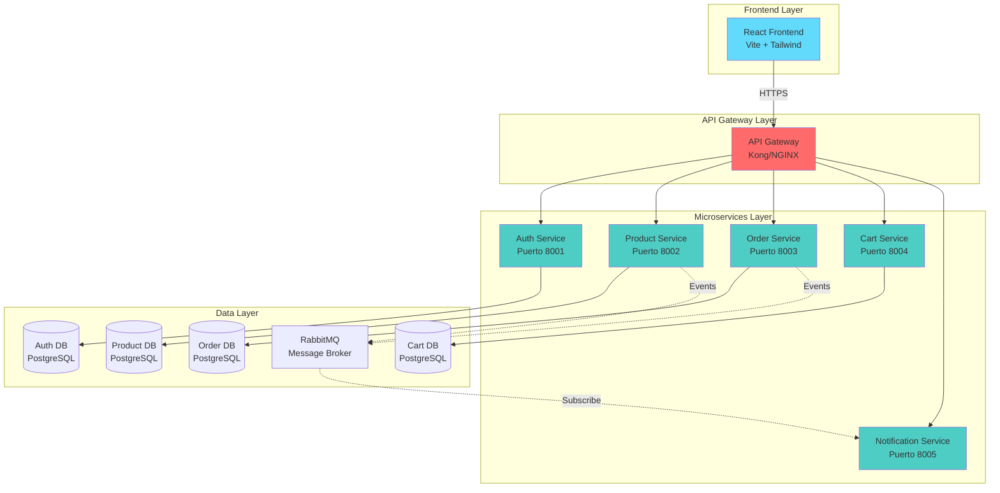
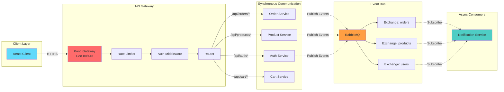
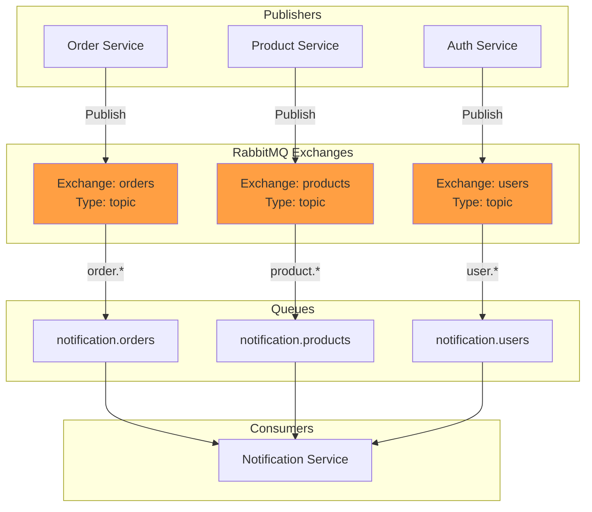
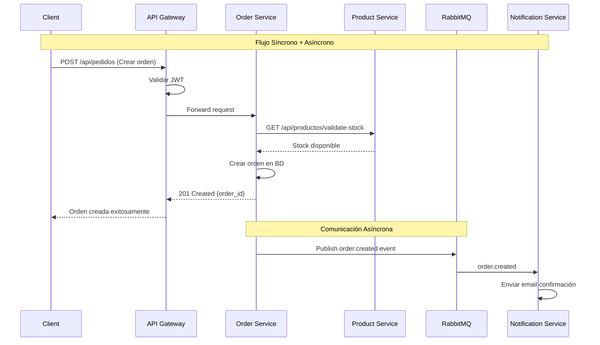
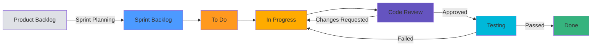

# Arquitectura de Microservicios para Class Smart

## Tabla de Contenidos
1. [Requerimientos Funcionales](#requerimientos-funcionales)
2. [Número de Microservicios y Responsabilidades](#número-de-microservicios-y-responsabilidades)
3. [API Gateway y Eventos](#api-gateway-y-eventos)
4. [Herramientas DevOps](#herramientas-devops)
5. [Herramientas de Metodología Ágil](#herramientas-de-metodología-ágil)

---

## Contexto del Proyecto

**Class Smart** es una plataforma de e-commerce educativo para estudiantes universitarios que actualmente opera con:

- **Frontend**: React 18.3.1 + Vite + Tailwind CSS + Axios
- **Backend**: Django 4.2.16 + Django REST Framework
- **Autenticación**: Token-based authentication JWT
- **Testing**: Jest + React Testing Library
- **Despliegue**: Vercel (Frontend) y Render (Backend)

---

## Requerimientos Funcionales

### 1. Gestión de Usuarios y Autenticación

**RF-001: Registro de Usuarios**
- El sistema debe permitir el registro de nuevos usuarios con validación de email
- Debe soportar reCAPTCHA para prevenir spam
- Campos requeridos: email, username, contraseña, nombre, apellido, teléfono
- El sistema debe enviar un email de verificación al registrarse

**RF-002: Autenticación de Usuarios**
- El sistema debe permitir login con email y contraseña
- Debe generar tokens JWT con tiempo de expiración
- Debe soportar refresh tokens para renovar sesiones
- Debe permitir cerrar sesión invalidando tokens

**RF-003: Gestión de Perfiles**
- Los usuarios deben poder actualizar su información personal
- Los administradores deben poder gestionar usuarios (CRUD completo)
- Debe soportar búsqueda de usuarios por diferentes criterios

**RF-004: Roles y Permisos**
- El sistema debe diferenciar entre usuarios Cliente y Administrador
- Los administradores tienen acceso completo a todas las funcionalidades
- Los clientes solo acceden a funciones de compra y consulta

### 2. Gestión de Productos

**RF-005: Catálogo de Productos**
- El sistema debe mostrar un catálogo de productos con paginación
- Cada producto debe tener: nombre, descripción, precio, stock, imágenes, SKU, categoría
- Los productos deben estar asociados a categorías
- Solo usuarios autenticados (admin) pueden crear/editar/eliminar productos

**RF-006: Búsqueda y Filtrado**
- El sistema debe permitir búsqueda de productos por nombre, descripción o SKU
- Debe permitir filtrado por categoría
- Debe permitir ordenamiento por precio, fecha de creación, nombre

**RF-007: Gestión de Stock**
- El sistema debe validar disponibilidad de stock antes de agregar al carrito
- Debe actualizar automáticamente el stock al crear pedidos
- Debe alertar cuando el stock sea bajo (menos de 10 unidades)
- Los administradores pueden actualizar stock manualmente

### 3. Gestión de Categorías

**RF-008: Administración de Categorías**
- El sistema debe permitir crear, editar y eliminar categorías
- Cada categoría debe tener: nombre, descripción, slug, imagen
- Las categorías deben estar disponibles públicamente
- Debe mostrar el número de productos por categoría

### 4. Carrito de Compras

**RF-009: Gestión del Carrito**
- Los usuarios autenticados deben poder agregar productos al carrito
- Deben poder modificar la cantidad de cada producto
- Deben poder eliminar productos del carrito
- El carrito debe persistir entre sesiones
- El sistema debe validar stock en tiempo real

**RF-010: Cálculo de Totales**
- El sistema debe calcular automáticamente subtotales por producto
- Debe calcular el total general del carrito
- Debe actualizar totales al modificar cantidades

### 5. Gestión de Pedidos

**RF-011: Creación de Pedidos**
- Los clientes deben poder crear pedidos desde su carrito
- Debe requerir dirección de envío y método de pago
- El sistema debe generar un número único de pedido
- Debe vaciar el carrito automáticamente al crear el pedido

**RF-012: Estados de Pedidos**
- Los pedidos deben tener estados.
- Los administradores deben poder cambiar el estado de los pedidos
- Los clientes deben poder ver el historial de sus pedidos
- Los clientes deben poder cancelar pedidos en estado Pendiente

**RF-013: Notificaciones de Pedidos**
- El sistema debe enviar email de confirmación al crear un pedido
- Debe enviar email al cancelar un pedido
- Debe notificar cambios de estado importantes

### 6. Favoritos

**RF-014: Lista de Favoritos**
- Los clientes deben poder marcar productos como favoritos
- Deben poder ver su lista completa de favoritos
- Deben poder eliminar productos de favoritos
- La lista debe persistir entre sesiones

### Resumen de Requerimientos No Funcionales

**RNF-001: Performance**
- Tiempo de respuesta < 200ms para operaciones de lectura
- Tiempo de respuesta < 500ms para operaciones de escritura
- Soporte para 1000 usuarios concurrentes

**RNF-002: Seguridad**
- Encriptación de contraseñas con bcrypt
- HTTPS en todas las comunicaciones
- Tokens JWT con expiración de 1 hora
- Rate limiting para prevenir ataques DoS

**RNF-003: Disponibilidad**
- Disponibilidad del 99.9% (SLA)
- Tiempo de recuperación ante fallos < 5 minutos
- Backups automáticos diarios

**RNF-004: Escalabilidad**
- Arquitectura que soporte escalado horizontal
- Procesamiento asíncrono para tareas pesadas

---

## Número de Microservicios y Responsabilidades

### Arquitectura General



### Total de Microservicios: 5

---

### 1. Auth Service (Servicio de Autenticación y Usuarios)

**Puerto**: 8001  
**Base de Datos**: PostgreSQL (auth_db)  
**Tecnología**: Django + DRF + djangorestframework-simplejwt

#### Responsabilidades:
- Registro de nuevos usuarios con validación de email
- Autenticación mediante JWT (access + refresh tokens)
- Verificación de email con tokens
- Gestión de sesiones y logout
- CRUD de usuarios (admin)
- Búsqueda y filtrado de usuarios
- Gestión de roles (Cliente/Administrador)
- Actualización de perfiles de usuario
- Recuperación de contraseña

#### Endpoints Principales:
```
POST   /api/auth/register              - Registro de usuario
POST   /api/auth/login                 - Autenticación
POST   /api/auth/logout                - Cerrar sesión
POST   /api/auth/refresh               - Renovar token
GET    /api/auth/verify-email/:token   - Verificar email
POST   /api/auth/forgot-password       - Recuperar contraseña
GET    /api/auth/me                    - Usuario actual
GET    /api/usuarios/                  - Listar usuarios [Admin]
PUT    /api/usuarios/update_user/      - Actualizar usuario
DELETE /api/usuarios/:id/              - Eliminar usuario [Admin]
GET    /api/usuarios/search_users/     - Buscar usuarios
```

#### Modelos de Datos:

Se utiliza el modelo de usuario personalizado de Django.  

```python
class User:
    - id: IntegerField
    - email: EmailField (unique)
    - username: CharField (unique)
    - password: CharField
    - first_name: CharField
    - last_name: CharField
    - phone_number: CharField
    - is_active: BooleanField
    - is_staff: BooleanField
    - is_superuser: BooleanField
    - date_joined: DateTimeField
    - last_login: DateTimeField
```


#### Eventos Publicados:
- `user.registered` - Cuando un usuario se registra
- `user.verified` - Cuando se verifica el email
- `user.updated` - Cuando se actualiza información del usuario

---

### 2. Servicio de Productos y Categorías

**Puerto**: 8002  
**Base de Datos**: PostgreSQL (product_db)  
**Tecnología**: Django + DRF

#### Responsabilidades:
- Gestión completa del catálogo de productos (CRUD)
- Gestión de categorías de productos (CRUD)
- Búsqueda y filtrado de productos
- Gestión de stock e inventario
- Upload y gestión de imágenes de productos
- Asociación de productos con categorías
- Validación de disponibilidad de stock
- Alertas de stock bajo

#### Endpoints Principales:
```
# Productos
GET    /api/productos/                 - Listar productos
POST   /api/productos/                 - Crear producto [Admin]
GET    /api/productos/:id/             - Obtener producto
PUT    /api/productos/:id/             - Actualizar producto [Admin]
PATCH  /api/productos/:id/             - Actualizar stock
DELETE /api/productos/:id/             - Eliminar producto [Admin]
GET    /api/filter_products/           - Buscar/filtrar productos
GET    /api/productos/low-stock/       - Productos con stock bajo [Admin]

# Categorías
GET    /api/categorias/                - Listar categorías
POST   /api/categorias/                - Crear categoría [Admin]
GET    /api/categorias/:id/            - Obtener categoría
PUT    /api/categorias/:id/            - Actualizar categoría [Admin]
DELETE /api/categorias/:id/            - Eliminar categoría [Admin]
GET    /api/categorias/:id/products/   - Productos de una categoría
```

#### Modelos de Datos:
```python
class Categoria:  
    - id: IntegerField
    - nombre_categoria: CharField (unique)

class Producto:
  -id: IntegerField
  -categoria: ForeignKey(Categoria)
  -nombre: CharField
  -descripcion: TextField
  -precio: DecimalField
  -cantidad_producto: IntegerField
  -foto_producto: URLField

class Favoritos:
  - id: IntegerField
  - usuario: ForeignKey(User)
  - producto: ForeignKey(Producto)  
```

#### Eventos Publicados:
- `product.created` - Cuando se crea un producto
- `product.updated` - Cuando se actualiza un producto
- `product.stock.low` - Cuando el stock es menor a 10
- `product.stock.updated` - Cuando se actualiza el stock
- `product.deleted` - Cuando se elimina un producto

---

### 3. Servicio de Pedidos

**Puerto**: 8003  
**Base de Datos**: PostgreSQL (order_db)  
**Tecnología**: Django + DRF

#### Responsabilidades:
- Creación de pedidos desde el carrito
- Gestión del ciclo de vida de pedidos
- Actualización de estados de pedidos
- Consulta de historial de pedidos por usuario
- Cancelación de pedidos
- Generación de reportes de pedidos
- Validación de stock con Product Service
- Coordinación con Payment Service
- Emisión de eventos para notificaciones

#### Endpoints Principales:
```
GET    /api/pedidos/                   - Listar pedidos [Admin/Cliente]
POST   /api/pedidos/                   - Crear pedido
GET    /api/pedidos/:id/               - Obtener pedido
PUT    /api/pedidos/:id/               - Actualizar estado [Admin]
DELETE /api/pedidos/:id/               - Cancelar pedido
GET    /api/pedidos/user/:userId/      - Pedidos de un usuario
GET    /api/pedidos_productos/         - Items de pedidos [Admin]
GET    /api/pedidos_productos/:id/     - Items de un pedido
POST   /api/send_email_cancel/         - Enviar email cancelación
```

#### Modelos de Datos:
```python
class Pedido:
  - id: IntegerField
  - usuarios: ForeignKey(User)
  - metodo_pago: CharField
  - direccion: CharField
  - productos: ManyToManyField(Producto)
  - hora: TimeField
  - estado_pedido: BooleanField
  - fecha: DateField

class PedidoProducto:
  - id: IntegerField
  - pedido_ppid: ForeignKey(Pedido)
  - producto_ppid: ForeignKey(Producto)
  - cantidad_producto_carrito: IntegerField
```

#### Eventos Publicados:
- `order.created` - Cuando se crea un pedido
- `order.updated` - Cuando se actualiza un pedido
- `order.status.changed` - Cuando cambia el estado
- `order.cancelled` - Cuando se cancela un pedido
- `order.completed` - Cuando se completa un pedido

#### Eventos Consumidos:
- `payment.success` - Del Payment Service
- `payment.failed` - Del Payment Service

---

### 4. Servicio de Carrito de Compras

**Puerto**: 8004  
**Base de Datos**: PostgreSQL (cart_db)  
**Tecnología**: Django + DRF

#### Responsabilidades:
- Agregar productos al carrito
- Modificar cantidad de productos en el carrito
- Eliminar productos del carrito
- Vaciar carrito completo
- Persistencia del carrito entre sesiones
- Validación de stock en tiempo real
- Cálculo de totales
- Consulta de productos del carrito por usuario

#### Endpoints Principales:
```
GET    /api/users_products/            - Items del carrito por usuario
POST   /api/users_products/            - Agregar al carrito
PATCH  /api/users_products/:id/        - Actualizar cantidad
DELETE /api/users_products/:id/        - Eliminar del carrito
DELETE /api/delete_all_userProducts/   - Vaciar carrito
GET    /api/search_users_products/     - Buscar productos en carrito
```

#### Modelos de Datos:
```python
class ProductoUsuario:
  - id: IntegerField
  - usuario: ForeignKey(User)
  - producto: ForeignKey(Producto)
  - cantidad_producto: IntegerField
```

#### Eventos Consumidos:
- `product.stock.updated` - Para validar disponibilidad
- `order.created` - Para vaciar el carrito

---

### 5. Notification Service (Servicio de Notificaciones)

**Puerto**: 8005  
**Base de Datos**: PostgreSQL (notification_db) para logs  
**Tecnología**: Django + Celery + SendGrid/SMTP

#### Responsabilidades:
- Envío de email de confirmación al crear un pedido
- Envío de email al cancelar un pedido
- Notificación de cambios de estado importantes de pedidos

#### Endpoints Principales:
```
POST   /api/notifications/email        - Enviar email
GET    /api/notifications/:userId      - Historial de notificaciones
```

#### Modelos de Datos:
```python
class Notification:
    - id: IntegerField
    - user_id: IntegerField
    - type: CharField (email)
    - template: CharField
    - subject: CharField
    - recipient: CharField
    - status: CharField (pending, sent, failed)
    - sent_at: DateTimeField
    - created_at: DateTimeField
```

#### Templates de Email:
- `order_confirmation` - Confirmación de pedido
- `order_cancelled` - Pedido cancelado
- `order_status_update` - Actualización de estado

#### Eventos Consumidos:
- `order.created` → Enviar email de confirmación
- `order.cancelled` → Enviar email de cancelación
- `order.status.changed` → Notificar cambio de estado

---

## API Gateway y Eventos

### Arquitectura de Comunicación



### API Gateway: Kong

#### ¿Por qué Kong?
- Open source y ampliamente utilizado
- Alto rendimiento (basado en NGINX)
- Plugins extensibles
- Rate limiting incorporado
- Autenticación JWT nativa
- Load balancing automático
- Service discovery
- Métricas y logging

#### Configuración de Kong

```yaml
# kong.yml - Configuración declarativa

_format_version: "3.0"

services:
  # Auth Service
  - name: auth-service
    url: http://auth-service:8000
    routes:
      - name: auth-routes
        paths:
          - /api/auth
          - /login
          - /register_user
          - /verify_email
    plugins:
      - name: rate-limiting
        config:
          minute: 20
          hour: 1000
      - name: cors
        config:
          origins:
            - https://classsmart.com
            - http://localhost:5173
          methods:
            - GET
            - POST
            - PUT
            - DELETE
            - PATCH
          headers:
            - Authorization
            - Content-Type
          credentials: true

  # Product Service
  - name: product-service
    url: http://product-service:8000
    routes:
      - name: product-routes
        paths:
          - /api/productos
          - /api/categorias
          - /api/filter_products
    plugins:
      - name: jwt
        config:
          claims_to_verify:
            - exp
      - name: rate-limiting
        config:
          minute: 100
      - name: response-transformer
        config:
          add:
            headers:
              - X-Service:products

  # Order Service
  - name: order-service
    url: http://order-service:8000
    routes:
      - name: order-routes
        paths:
          - /api/pedidos
          - /api/pedidos_productos
    plugins:
      - name: jwt
      - name: rate-limiting
        config:
          minute: 50

  # Cart Service
  - name: cart-service
    url: http://cart-service:8000
    routes:
      - name: cart-routes
        paths:
          - /api/users_products
          - /api/delete_all_userProducts
          - /api/search_users_products
    plugins:
      - name: jwt
      - name: rate-limiting
        config:
          minute: 100

  # Notification Service
  - name: notification-service
    url: http://notification-service:8000
    routes:
      - name: notification-routes
        paths:
          - /api/notifications
    plugins:
      - name: jwt
      - name: rate-limiting
        config:
          minute: 50

# Upstreams para load balancing
upstreams:
  - name: product-upstream
    targets:
      - target: product-service-1:8000
        weight: 100
      - target: product-service-2:8000
        weight: 100
```

#### Plugins Clave de Kong

1. **JWT Plugin**: Validación de tokens
2. **Rate Limiting**: Prevención de abuso
3. **CORS**: Configuración de CORS
4. **Request/Response Transformer**: Modificar requests/responses
5. **Proxy Cache**: Caché de respuestas
6. **Request Termination**: Bloquear requests según criterios
7. **Prometheus**: Métricas para monitoreo

### Sistema de Eventos con RabbitMQ

#### ¿Por qué RabbitMQ?
- Protocolo AMQP robusto
- Garantías de entrega de mensajes
- Soporte para múltiples patrones (pub/sub, work queues)
- Dead Letter Queues para manejo de errores
- Management UI integrado
- Clustering para alta disponibilidad

#### Topología de Exchanges y Queues



#### Configuración de RabbitMQ

```python
# shared/messaging/rabbitmq_config.py
import pika
from django.conf import settings

class RabbitMQConfig:
    EXCHANGES = {
        'orders': {
            'type': 'topic',
            'durable': True,
            'routing_keys': [
                'order.created',
                'order.updated',
                'order.cancelled',
                'order.completed',
                'order.status.changed'
            ]
        },
        'products': {
            'type': 'topic',
            'durable': True,
            'routing_keys': [
                'product.created',
                'product.updated',
                'product.deleted',
                'product.stock.updated',
                'product.stock.low'
            ]
        },
        'users': {
            'type': 'topic',
            'durable': True,
            'routing_keys': [
                'user.registered',
                'user.verified',
                'user.updated',
                'user.deleted'
            ]
        }
    }
```

#### Publisher Base Class

```python
# shared/messaging/publisher.py
import pika
import json
import logging
from django.conf import settings

logger = logging.getLogger(__name__)

class EventPublisher:
    def __init__(self):
        self.connection = None
        self.channel = None
        self.connect()
    
    def connect(self):
        """Establecer conexión con RabbitMQ"""
        try:
            credentials = pika.PlainCredentials(
                settings.RABBITMQ_USER,
                settings.RABBITMQ_PASSWORD
            )
            parameters = pika.ConnectionParameters(
                host=settings.RABBITMQ_HOST,
                port=settings.RABBITMQ_PORT,
                virtual_host='/',
                credentials=credentials,
                heartbeat=600,
                blocked_connection_timeout=300
            )
            self.connection = pika.BlockingConnection(parameters)
            self.channel = self.connection.channel()
            logger.info("Conectado a RabbitMQ")
        except Exception as e:
            logger.error(f"Error conectando a RabbitMQ: {e}")
            raise
    
    def publish(self, exchange, routing_key, message, retries=3):
        """Publicar evento con reintentos"""
        for attempt in range(retries):
            try:
                if not self.connection or self.connection.is_closed:
                    self.connect()
                
                self.channel.exchange_declare(
                    exchange=exchange,
                    exchange_type='topic',
                    durable=True
                )
                
                self.channel.basic_publish(
                    exchange=exchange,
                    routing_key=routing_key,
                    body=json.dumps(message, default=str),
                    properties=pika.BasicProperties(
                        delivery_mode=2,  # Persistente
                        content_type='application/json',
                        timestamp=int(time.time())
                    )
                )
                
                logger.info(f"Evento publicado: {exchange}.{routing_key}")
                return True
            
            except Exception as e:
                logger.error(f"Error publicando evento (intento {attempt + 1}): {e}")
                if attempt == retries - 1:
                    raise
                time.sleep(1 * (attempt + 1))  # Backoff exponencial
        
        return False
    
    def close(self):
        """Cerrar conexión"""
        if self.connection and not self.connection.is_closed:
            self.connection.close()
            logger.info("Conexión a RabbitMQ cerrada")

# Instancia global
event_publisher = EventPublisher()
```

#### Consumer Base Class

```python
# shared/messaging/consumer.py
import pika
import json
import logging
from abc import ABC, abstractmethod

logger = logging.getLogger(__name__)

class EventConsumer(ABC):
    def __init__(self, queue_name, exchange, routing_key):
        self.queue_name = queue_name
        self.exchange = exchange
        self.routing_key = routing_key
        self.connection = None
        self.channel = None
    
    def connect(self):
        """Establecer conexión"""
        credentials = pika.PlainCredentials(
            settings.RABBITMQ_USER,
            settings.RABBITMQ_PASSWORD
        )
        parameters = pika.ConnectionParameters(
            host=settings.RABBITMQ_HOST,
            port=settings.RABBITMQ_PORT,
            credentials=credentials
        )
        self.connection = pika.BlockingConnection(parameters)
        self.channel = self.connection.channel()
        
        # Declarar exchange
        self.channel.exchange_declare(
            exchange=self.exchange,
            exchange_type='topic',
            durable=True
        )
        
        # Declarar queue
        self.channel.queue_declare(
            queue=self.queue_name,
            durable=True
        )
        
        # Binding
        self.channel.queue_bind(
            exchange=self.exchange,
            queue=self.queue_name,
            routing_key=self.routing_key
        )
        
        # QoS - Procesar 1 mensaje a la vez
        self.channel.basic_qos(prefetch_count=1)
        
        logger.info(f"Consumer conectado: {self.queue_name}")
    
    def callback(self, ch, method, properties, body):
        """Callback para procesar mensajes"""
        try:
            message = json.loads(body)
            logger.info(f"Mensaje recibido: {method.routing_key}")
            
            # Procesar mensaje (implementado por subclase)
            self.process_message(method.routing_key, message)
            
            # Acknowledge
            ch.basic_ack(delivery_tag=method.delivery_tag)
            
        except Exception as e:
            logger.error(f"Error procesando mensaje: {e}")
            # Negative acknowledge - requeue
            ch.basic_nack(
                delivery_tag=method.delivery_tag,
                requeue=False  # Enviar a DLQ
            )
    
    @abstractmethod
    def process_message(self, routing_key, message):
        """Implementar en subclase"""
        pass
    
    def start_consuming(self):
        """Iniciar consumidor"""
        self.connect()
        self.channel.basic_consume(
            queue=self.queue_name,
            on_message_callback=self.callback
        )
        logger.info(f"Iniciando consumo de {self.queue_name}")
        self.channel.start_consuming()
```

#### Ejemplo de Uso - Order Service Publisher

```python
# order-service/orders/events.py
from shared.messaging.publisher import event_publisher
from django.dispatch import receiver
from django.db.models.signals import post_save
from .models import Order

@receiver(post_save, sender=Order)
def publish_order_event(sender, instance, created, **kwargs):
    """Publicar evento cuando se crea o actualiza una orden"""
    
    if created:
        routing_key = 'order.created'
    else:
        routing_key = 'order.updated'
    
    message = {
        'order_id': instance.id,
        'order_number': instance.order_number,
        'user_id': instance.user_id,
        'status': instance.status,
        'total': float(instance.total),
        'items': [
            {
                'product_id': item.product_id,
                'product_name': item.product_name,
                'quantity': item.quantity,
                'price': float(item.product_price)
            }
            for item in instance.items.all()
        ],
        'created_at': instance.created_at.isoformat(),
        'updated_at': instance.updated_at.isoformat()
    }
    
    event_publisher.publish(
        exchange='orders',
        routing_key=routing_key,
        message=message
    )
```

#### Ejemplo de Uso - Notification Service Consumer

```python
# notification-service/consumers/order_consumer.py
from shared.messaging.consumer import EventConsumer
from notifications.tasks import send_order_email

class OrderEventConsumer(EventConsumer):
    def __init__(self):
        super().__init__(
            queue_name='notification.orders',
            exchange='orders',
            routing_key='order.*'
        )
    
    def process_message(self, routing_key, message):
        """Procesar eventos de órdenes"""
        
        if routing_key == 'order.created':
            self.handle_order_created(message)
        elif routing_key == 'order.cancelled':
            self.handle_order_cancelled(message)
        elif routing_key == 'order.status.changed':
            self.handle_status_changed(message)
    
    def handle_order_created(self, message):
        """Enviar email de confirmación"""
        send_order_email.delay(
            template='order_confirmation',
            user_id=message['user_id'],
            context=message
        )
    
    def handle_order_cancelled(self, message):
        """Enviar email de cancelación"""
        send_order_email.delay(
            template='order_cancelled',
            user_id=message['user_id'],
            context=message
        )
    
    def handle_status_changed(self, message):
        """Notificar cambio de estado"""
        if message['status'] in ['shipped', 'delivered']:
            send_order_email.delay(
                template='order_status_update',
                user_id=message['user_id'],
                context=message
            )

# Ejecutar consumer
if __name__ == '__main__':
    consumer = OrderEventConsumer()
    consumer.start_consuming()
```

### Patrones de Comunicación



**Comunicación Síncrona (REST)**:
- Request-Response inmediato
- Para operaciones críticas que requieren confirmación
- Timeout de 5 segundos por defecto

**Comunicación Asíncrona (Eventos)**:
- Eventual consistency
- Para operaciones no críticas o que afectan múltiples servicios
- Garantía de entrega con acknowledgements

---

## Herramientas DevOps

### Pipeline CI/CD Completo

```mermaid
graph LR
    subgraph "Source Control"
        GIT[GitHub<br/>Repository]
    end
    
    subgraph "CI - GitHub Actions"
        BUILD[Build & Test]
        LINT[Linting]
        SECURITY[Security Scan]
        DOCKER[Docker Build]
    end
    
    subgraph "Registry"
        REGISTRY[Docker Hub /<br/>GitHub Container<br/>Registry]
    end
    
    subgraph "CD - Deployment"
        DEV[Deploy to Dev]
        STAGING[Deploy to Staging]
        PROD[Deploy to Production]
    end
    
    subgraph "Infrastructure"
        K8S[Kubernetes<br/>Cluster]
        MONITORING[Monitoring Stack]
    end
    
    GIT -->|Push/PR| BUILD
    BUILD --> LINT
    LINT --> SECURITY
    SECURITY --> DOCKER
    DOCKER -->|Push Image| REGISTRY
    
    REGISTRY -->|Auto Deploy| DEV
    DEV -->|Manual Approve| STAGING
    STAGING -->|Manual Approve| PROD
    
    PROD --> K8S
    K8S --> MONITORING
    
    style GIT fill:#4078c0
    style DOCKER fill:#2496ed
    style K8S fill:#326ce5
    style MONITORING fill:#e25822
```



### 1. Control de Versiones: GitHub

**Repositorio**: `github.com/emilynunezordonez/class_smart`

**Estrategia de Branching - GitFlow**:
```
main (producción)
  └── develop (desarrollo)
       ├── feature/auth-service
       ├── feature/product-catalog
       ├── hotfix/security-patch
       └── release/v1.0.0
```

**Protección de Branches**:
- Require pull request reviews (mínimo 1 aprobación)
- Status checks must pass
- No direct commits to main/develop
- Require linear history

### 2. CI/CD: GitHub Actions

#### Workflow para Microservicios

```yaml
# .github/workflows/microservice-ci-cd.yml
name: Microservice CI/CD

on:
  push:
    branches: [ main, develop ]
    paths:
      - 'backend/**'
  pull_request:
    branches: [ main, develop ]

env:
  REGISTRY: ghcr.io
  IMAGE_NAME: ${{ github.repository }}

jobs:
  # Job 1: Tests y Linting
  test:
    runs-on: ubuntu-latest
    strategy:
      matrix:
        service: [auth-service, product-service, order-service, cart-service, notification-service]
    
    steps:
      - uses: actions/checkout@v3
      
      - name: Set up Python
        uses: actions/setup-python@v4
        with:
          python-version: '3.11'
      
      - name: Cache dependencies
        uses: actions/cache@v3
        with:
          path: ~/.cache/pip
          key: ${{ runner.os }}-pip-${{ hashFiles('**/requirements.txt') }}
      
      - name: Install dependencies
        run: |
          cd backend/${{ matrix.service }}
          pip install -r requirements.txt
          pip install pytest pytest-django pytest-cov flake8
      
      - name: Lint with flake8
        run: |
          cd backend/${{ matrix.service }}
          flake8 . --count --select=E9,F63,F7,F82 --show-source --statistics
      
      - name: Run tests with coverage
        run: |
          cd backend/${{ matrix.service }}
          pytest --cov=. --cov-report=xml --cov-report=html
      
      - name: Upload coverage to Codecov
        uses: codecov/codecov-action@v3
        with:
          file: ./backend/${{ matrix.service }}/coverage.xml
          flags: ${{ matrix.service }}

  # Job 2: Security Scanning
  security:
    runs-on: ubuntu-latest
    steps:
      - uses: actions/checkout@v3
      
      - name: Run Trivy vulnerability scanner
        uses: aquasecurity/trivy-action@master
        with:
          scan-type: 'fs'
          scan-ref: '.'
          format: 'sarif'
          output: 'trivy-results.sarif'
      
      - name: Upload Trivy results to GitHub Security
        uses: github/codeql-action/upload-sarif@v2
        with:
          sarif_file: 'trivy-results.sarif'

  # Job 3: Build y Push Docker Images
  build:
    needs: [test, security]
    runs-on: ubuntu-latest
    if: github.event_name == 'push'
    strategy:
      matrix:
        service: [auth-service, product-service, order-service, cart-service, notification-service]
    
    steps:
      - uses: actions/checkout@v3
      
      - name: Set up Docker Buildx
        uses: docker/setup-buildx-action@v2
      
      - name: Log in to Container Registry
        uses: docker/login-action@v2
        with:
          registry: ${{ env.REGISTRY }}
          username: ${{ github.actor }}
          password: ${{ secrets.GITHUB_TOKEN }}
      
      - name: Extract metadata
        id: meta
        uses: docker/metadata-action@v4
        with:
          images: ${{ env.REGISTRY }}/${{ env.IMAGE_NAME }}/${{ matrix.service }}
          tags: |
            type=ref,event=branch
            type=semver,pattern={{version}}
            type=sha,prefix={{branch}}-
      
      - name: Build and push Docker image
        uses: docker/build-push-action@v4
        with:
          context: ./backend/${{ matrix.service }}
          push: true
          tags: ${{ steps.meta.outputs.tags }}
          labels: ${{ steps.meta.outputs.labels }}
          cache-from: type=gha
          cache-to: type=gha,mode=max

  # Job 4: Deploy to Development
  deploy-dev:
    needs: build
    runs-on: ubuntu-latest
    if: github.ref == 'refs/heads/develop'
    environment:
      name: development
      url: https://dev.classsmart.com
    
    steps:
      - uses: actions/checkout@v3
      
      - name: Configure kubectl
        uses: azure/k8s-set-context@v3
        with:
          method: kubeconfig
          kubeconfig: ${{ secrets.KUBE_CONFIG_DEV }}
      
      - name: Deploy to Kubernetes
        run: |
          kubectl apply -f k8s/dev/ -n class-smart-dev
          kubectl rollout status deployment -n class-smart-dev
      
      - name: Verify deployment
        run: |
          kubectl get pods -n class-smart-dev
          kubectl get services -n class-smart-dev

  # Job 5: Deploy to Production
  deploy-prod:
    needs: build
    runs-on: ubuntu-latest
    if: github.ref == 'refs/heads/main'
    environment:
      name: production
      url: https://classsmart.com
    
    steps:
      - uses: actions/checkout@v3
      
      - name: Configure kubectl
        uses: azure/k8s-set-context@v3
        with:
          method: kubeconfig
          kubeconfig: ${{ secrets.KUBE_CONFIG_PROD }}
      
      - name: Deploy to Production
        run: |
          kubectl apply -f k8s/prod/ -n class-smart-prod
          kubectl rollout status deployment -n class-smart-prod --timeout=10m
      
      - name: Run smoke tests
        run: |
          ./scripts/smoke-tests.sh https://api.classsmart.com
      
      - name: Notify Slack
        if: always()
        uses: slackapi/slack-github-action@v1
        with:
          payload: |
            {
              "text": "Deployment to Production: ${{ job.status }}",
              "blocks": [
                {
                  "type": "section",
                  "text": {
                    "type": "mrkdwn",
                    "text": "Deployment *${{ job.status }}* for <${{ github.server_url }}/${{ github.repository }}/commit/${{ github.sha }}|${{ github.sha }}>"
                  }
                }
              ]
            }
        env:
          SLACK_WEBHOOK_URL: ${{ secrets.SLACK_WEBHOOK }}
```

#### Workflow para Frontend

```yaml
# .github/workflows/frontend-ci-cd.yml
name: Frontend CI/CD

on:
  push:
    branches: [ main, develop ]
    paths:
      - 'src/**'
      - 'package.json'
  pull_request:
    branches: [ main, develop ]

jobs:
  test:
    runs-on: ubuntu-latest
    steps:
      - uses: actions/checkout@v3
      
      - name: Setup Node.js
        uses: actions/setup-node@v3
        with:
          node-version: '18'
          cache: 'npm'
      
      - name: Install dependencies
        run: npm ci
      
      - name: Run linter
        run: npm run lint
      
      - name: Run tests
        run: npm test -- --coverage
      
      - name: Upload coverage
        uses: codecov/codecov-action@v3
        with:
          files: ./coverage/lcov.info
          flags: frontend

  build:
    needs: test
    runs-on: ubuntu-latest
    steps:
      - uses: actions/checkout@v3
      
      - name: Setup Node.js
        uses: actions/setup-node@v3
        with:
          node-version: '18'
          cache: 'npm'
      
      - name: Install dependencies
        run: npm ci
      
      - name: Build
        run: npm run build
        env:
          VITE_API_GATEWAY_URL: ${{ secrets.API_GATEWAY_URL }}
      
      - name: Upload build artifacts
        uses: actions/upload-artifact@v3
        with:
          name: dist
          path: dist/

  deploy-vercel:
    needs: build
    runs-on: ubuntu-latest
    if: github.ref == 'refs/heads/main'
    steps:
      - uses: actions/checkout@v3
      
      - name: Deploy to Vercel
        uses: amondnet/vercel-action@v20
        with:
          vercel-token: ${{ secrets.VERCEL_TOKEN }}
          vercel-org-id: ${{ secrets.VERCEL_ORG_ID }}
          vercel-project-id: ${{ secrets.VERCEL_PROJECT_ID }}
          vercel-args: '--prod'
```

### 3. Containerización: Docker

#### Dockerfile Multi-stage Optimizado

```dockerfile
# backend/auth-service/Dockerfile
# Stage 1: Build
FROM python:3.11-slim as builder

WORKDIR /app

# Instalar dependencias de compilación
RUN apt-get update && apt-get install -y --no-install-recommends \
    gcc \
    postgresql-client \
    && rm -rf /var/lib/apt/lists/*

# Copiar requirements
COPY requirements.txt .

# Instalar dependencias en un directorio separado
RUN pip install --user --no-cache-dir -r requirements.txt

# Stage 2: Runtime
FROM python:3.11-slim

WORKDIR /app

# Copiar dependencias desde builder
COPY --from=builder /root/.local /root/.local

# Asegurar que scripts en .local están en PATH
ENV PATH=/root/.local/bin:$PATH

# Instalar solo runtime dependencies
RUN apt-get update && apt-get install -y --no-install-recommends \
    postgresql-client \
    && rm -rf /var/lib/apt/lists/*

# Copiar código de aplicación
COPY . .

# Crear usuario no-root
RUN useradd -m -u 1000 appuser && \
    chown -R appuser:appuser /app

USER appuser

# Variables de entorno
ENV PYTHONUNBUFFERED=1 \
    PYTHONDONTWRITEBYTECODE=1 \
    DJANGO_SETTINGS_MODULE=auth_service.settings

# Health check
HEALTHCHECK --interval=30s --timeout=10s --start-period=40s --retries=3 \
    CMD python -c "import requests; requests.get('http://localhost:8000/health')"

# Exponer puerto
EXPOSE 8000

# Comando de inicio
CMD ["gunicorn", "--bind", "0.0.0.0:8000", "--workers", "4", "--timeout", "120", "auth_service.wsgi:application"]
```

### 4. Orquestación: Kubernetes

#### Deployment Example

```yaml
# k8s/prod/auth-service-deployment.yaml
apiVersion: apps/v1
kind: Deployment
metadata:
  name: auth-service
  namespace: class-smart-prod
  labels:
    app: auth-service
    version: v1.0.0
spec:
  replicas: 3
  strategy:
    type: RollingUpdate
    rollingUpdate:
      maxSurge: 1
      maxUnavailable: 0
  selector:
    matchLabels:
      app: auth-service
  template:
    metadata:
      labels:
        app: auth-service
        version: v1.0.0
    spec:
      containers:
      - name: auth-service
        image: ghcr.io/emilynunezordonez/class_smart/auth-service:latest
        ports:
        - containerPort: 8000
          name: http
        env:
        - name: DB_HOST
          valueFrom:
            configMapKeyRef:
              name: auth-config
              key: db_host
        - name: DB_NAME
          valueFrom:
            secretKeyRef:
              name: auth-secrets
              key: db_name
        - name: DB_PASSWORD
          valueFrom:
            secretKeyRef:
              name: auth-secrets
              key: db_password
        - name: SECRET_KEY
          valueFrom:
            secretKeyRef:
              name: auth-secrets
              key: secret_key
        - name: RABBITMQ_HOST
          value: rabbitmq-service
        resources:
          requests:
            memory: "256Mi"
            cpu: "250m"
          limits:
            memory: "512Mi"
            cpu: "500m"
        livenessProbe:
          httpGet:
            path: /health
            port: 8000
          initialDelaySeconds: 30
          periodSeconds: 10
          timeoutSeconds: 5
          failureThreshold: 3
        readinessProbe:
          httpGet:
            path: /ready
            port: 8000
          initialDelaySeconds: 10
          periodSeconds: 5
          timeoutSeconds: 3
          failureThreshold: 2
      affinity:
        podAntiAffinity:
          preferredDuringSchedulingIgnoredDuringExecution:
          - weight: 100
            podAffinityTerm:
              labelSelector:
                matchExpressions:
                - key: app
                  operator: In
                  values:
                  - auth-service
              topologyKey: kubernetes.io/hostname
---
apiVersion: v1
kind: Service
metadata:
  name: auth-service
  namespace: class-smart-prod
spec:
  selector:
    app: auth-service
  ports:
  - protocol: TCP
    port: 80
    targetPort: 8000
  type: ClusterIP
---
apiVersion: autoscaling/v2
kind: HorizontalPodAutoscaler
metadata:
  name: auth-service-hpa
  namespace: class-smart-prod
spec:
  scaleTargetRef:
    apiVersion: apps/v1
    kind: Deployment
    name: auth-service
  minReplicas: 3
  maxReplicas: 10
  metrics:
  - type: Resource
    resource:
      name: cpu
      target:
        type: Utilization
        averageUtilization: 70
  - type: Resource
    resource:
      name: memory
      target:
        type: Utilization
        averageUtilization: 80
```

### 6. Monitoreo: Prometheus + Grafana

```yaml
# k8s/monitoring/prometheus-config.yaml
apiVersion: v1
kind: ConfigMap
metadata:
  name: prometheus-config
  namespace: monitoring
data:
  prometheus.yml: |
    global:
      scrape_interval: 15s
      evaluation_interval: 15s
    
    scrape_configs:
      - job_name: 'kubernetes-apiservers'
        kubernetes_sd_configs:
        - role: endpoints
        scheme: https
        tls_config:
          ca_file: /var/run/secrets/kubernetes.io/serviceaccount/ca.crt
        bearer_token_file: /var/run/secrets/kubernetes.io/serviceaccount/token
      
      - job_name: 'kubernetes-pods'
        kubernetes_sd_configs:
        - role: pod
        relabel_configs:
        - source_labels: [__meta_kubernetes_pod_annotation_prometheus_io_scrape]
          action: keep
          regex: true
        - source_labels: [__meta_kubernetes_pod_annotation_prometheus_io_path]
          action: replace
          target_label: __metrics_path__
          regex: (.+)
        - source_labels: [__address__, __meta_kubernetes_pod_annotation_prometheus_io_port]
          action: replace
          regex: ([^:]+)(?::\d+)?;(\d+)
          replacement: $1:$2
          target_label: __address__
      
      - job_name: 'auth-service'
        static_configs:
        - targets: ['auth-service:8000']
      
      - job_name: 'product-service'
        static_configs:
        - targets: ['product-service:8000']
      
      - job_name: 'order-service'
        static_configs:
        - targets: ['order-service:8000']
      
      - job_name: 'rabbitmq'
        static_configs:
        - targets: ['rabbitmq:15692']
      
      - job_name: 'postgres'
        static_configs:
        - targets: ['postgres-exporter:9187']
      
      - job_name: 'notification-service'
        static_configs:
        - targets: ['notification-service:8000']
```


### Resumen de Herramientas DevOps

| Categoría | Herramienta | Propósito |
|-----------|-------------|-----------|
| **Version Control** | GitHub | Repositorio de código y gestión de PRs |
| **CI/CD** | GitHub Actions | Automatización de build, test y deploy |
| **Containerización** | Docker | Empaquetado de aplicaciones |
| **Container Registry** | GitHub Container Registry | Almacenamiento de imágenes Docker |
| **Orquestación** | Kubernetes (EKS) | Gestión de contenedores en producción |
| **Monitoreo** | Prometheus + Grafana | Métricas y visualización |
| **API Gateway** | Kong | Gateway y rate limiting |
| **Message Broker** | RabbitMQ | Mensajería asíncrona |
| **Database** | PostgreSQL | Base de datos relacional |

---

## Herramientas de Metodología Ágil

### 1. Gestión de Proyecto: Jira

#### Configuración de Proyecto

**Tipo de Proyecto**: Scrum  
**Nombre**: Class Smart - Microservices Migration

#### Board Configuration



#### Epic Structure

```
Epic 1: Auth Service Migration
  ├── Story: Setup Auth Service Project
  ├── Story: Implement User Registration
  ├── Story: Implement JWT Authentication
  ├── Story: Email Verification
  └── Story: Deploy Auth Service

Epic 2: Product Service Migration
  ├── Story: Setup Product Service Project
  ├── Story: Product CRUD Operations
  ├── Story: Category Management
  ├── Story: Search and Filtering
  └── Story: Deploy Product Service

Epic 3: Order Service Migration
  ├── Story: Setup Order Service Project
  ├── Story: Order Creation Flow
  ├── Story: Order State Machine
  ├── Story: Integration with Product Service
  └── Story: Deploy Order Service

Epic 4: Notification Service Migration
  ├── Story: Setup Notification Service Project
  ├── Story: Email Integration (SendGrid/SMTP)
  ├── Story: Order Notification Templates
  └── Story: Deploy Notification Service

Epic 5: Infrastructure Setup
  ├── Story: Kubernetes Cluster Setup
  ├── Story: CI/CD Pipeline
  ├── Story: API Gateway Configuration
  ├── Story: RabbitMQ Setup
  └── Story: Monitoring Stack

Epic 6: Frontend Adaptation
  ├── Story: API Client Refactoring
  ├── Story: Update Authentication Flow
  ├── Story: Update Product Pages
  ├── Story: Update Order Pages
  └── Story: Testing and QA
```

#### Issue Types

**Epic**: Grandes iniciativas (migración de un servicio completo)
**Story**: Funcionalidades específicas (3-8 puntos de historia)
**Task**: Tareas técnicas (1-3 puntos)
**Sub-task**: División de stories grandes

#### Sprint Configuration

- **Duración**: 2 semanas
- **Sprint Planning**: Lunes (2 horas)
- **Daily Standup**: Todos los días (15 minutos)
- **Sprint Review**: Viernes semana 2 (1 hora)
- **Retrospective**: Viernes semana 2 (1 hora)


### 2. Code Review: GitHub Pull Requests

### 3. Testing: Jest + Pytest

#### Coverage Goals

- **Unit Tests**: > 80% coverage
- **Integration Tests**: Critical paths covered
- **E2E Tests**: Main user journeys

---